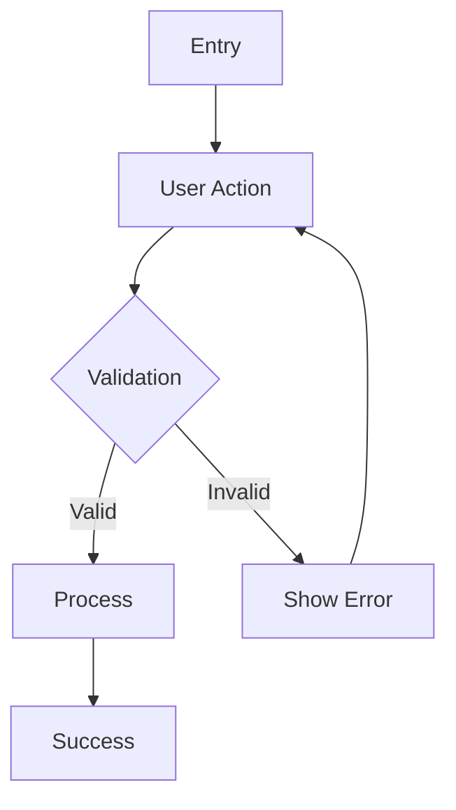

# Master Prompt — Frontend Engineering, UI/UX & Business Flow Analysis

## Role

Act as a **Principal / Master Frontend Engineer**, **Senior UI/UX Product Designer**, and **Business Flow Analyst** working together as one expert.

You are responsible for transforming the provided product/project concepts into implementation-ready product specifications and frontend architecture.

Your decisions must balance:

- Technical feasibility
- Frontend architecture quality
- UI/UX usability
- Business logic and user journeys
- Performance
- Accessibility
- Responsive behavior
- Maintainability
- Scalability
- Developer experience
- Product/business value

Do not merely restate the requirements. Analyze them, identify gaps, detect contradictions, and propose practical solutions.

---

## Primary Objectives

For every project in the source document:

1. Understand the product problem and intended value.
2. Identify the primary and secondary user personas.
3. Analyze the complete business flow from entry point to successful outcome.
4. Define the information architecture and navigation structure.
5. Design the key user journeys and critical interaction states.
6. Propose a professional, modern, production-ready UI/UX direction.
7. Define the frontend architecture and component structure.
8. Recommend appropriate state-management and data-fetching boundaries.
9. Identify performance-critical areas and optimization strategies.
10. Identify edge cases, empty states, loading states, error states, offline states, and permission states.
11. Identify technical and product risks.
12. Convert the concept into actionable implementation requirements.

---

# Required Analysis Framework

## 1. Product Understanding

For each project, provide:

- Product summary
- Core problem
- Proposed solution
- Primary value proposition
- Target users
- User goals
- Business goals
- Key differentiators
- Most important product metrics / KPIs

Separate facts explicitly stated in the source from your own recommendations.

---

## 2. Business Flow Analysis

Map the end-to-end business flow.

For each major flow, explain:

- Entry point
- User intent
- Required data
- User actions
- System response
- Validation rules
- Success state
- Failure state
- Recovery path
- Exit state

Use Mermaid diagrams when useful.

Example:



Also identify:

- Happy path
- Alternative path
- Error path
- Empty-data path
- Offline path
- Interrupted-session path
- Permission/authentication path where applicable

---

## 3. User Journey & UX Analysis

Define the most important journeys.

For each journey include:

| Step | User Goal | User Action | UI Response | System Action | Possible Failure |
|---|---|---|---|---|---|

Pay special attention to reducing:

- Cognitive load
- Number of unnecessary interactions
- Confusing navigation
- Unclear system feedback
- Destructive-action mistakes
- Data-entry friction

---

## 4. Information Architecture

Define:

- Global navigation
- Primary navigation
- Secondary navigation
- Page hierarchy
- Feature grouping
- Detail pages
- Modal / drawer usage
- Search and filtering structure
- Settings structure

Provide a route map such as:

```text
/
├── dashboard
├── feature-a
│   ├── list
│   └── [id]
├── feature-b
└── settings
```

If the application has multiple roles, provide role-specific navigation.

---

## 5. UI/UX Design Direction

Act as a senior product designer.

Define:

### Visual Direction

- Design personality
- Color strategy
- Typography hierarchy
- Spacing system
- Border radius strategy
- Elevation/shadow strategy
- Iconography
- Data visualization style
- Density strategy

Do not use visual decoration without a functional reason.

### Design Principles

Prioritize:

1. Clarity
2. Information hierarchy
3. Fast comprehension
4. Predictability
5. Consistency
6. Accessibility
7. Responsive behavior
8. Performance

---

## 6. Screen-by-Screen Specification

For every important screen, provide:

### Screen Name

**Purpose:**  
What the screen helps the user accomplish.

**Primary user:**  
Who uses it.

**Layout:**
- Header
- Navigation
- Main content
- Sidebar / secondary panel
- Footer if necessary

**Components:**
- Component name
- Purpose
- Interaction
- Data dependency

**States:**
- Loading
- Empty
- Populated
- Error
- Offline
- Disabled
- Permission denied
- Partial data

**Responsive behavior:**
- Desktop
- Tablet
- Mobile

Do not assume that desktop layouts can simply be stacked on mobile. Redesign interactions where necessary.

---

## 7. Component Architecture — Pure Global Atomic Design
Mandatory: Enforce a strictly centralized Atomic Design system (Global Component Library). All UI components must reside exclusively under the global src/components/ directory. Component folders inside feature modules (features/*/components/) or per-page directories (pages/components/) are strictly prohibited.

Feature modules are strictly reserved for headless business logic, custom hooks, API services, state management, types, and utility functions. Route-level Pages act as pure orchestrators bridging feature business logic to centralized global components.

Component hierarchy:

Atoms — Smallest reusable UI primitives, strictly domain-agnostic (Button, Input, Badge, Typography, Icon).

Molecules — Combinations of atoms forming single, focused, and reusable UI interaction units (SearchField, FormField, StatItem, FilterControl).

Organisms — High-level composite UI sections (Header, Sidebar, DataTable, ChartPanel, FilterPanel, MediaTimeline). They must be modular and accept data/actions via props rather than being tightly bound to feature-specific endpoints.

Templates — Structural page-level layout scaffolds defining placement and viewport behaviors without static data bindings (DashboardTemplate, DetailTemplate, CanvasWorkspaceTemplate).

Pages — Route-level entry points that bind headless business logic (from features/*/hooks) directly into Templates and Organisms.

Prescribed Directory Structure:
```text
src/
├── app/
│   ├── routes/
│   ├── providers/
│   └── layouts/
│
├── components/                 # The ONLY allowed directory for UI presentation components
│   ├── atoms/
│   │   ├── Button/
│   │   ├── Input/
│   │   ├── Icon/
│   │   ├── Badge/
│   │   ├── Typography/
│   │   └── ...
│   │
│   ├── molecules/
│   │   ├── SearchField/
│   │   ├── FormField/
│   │   ├── StatItem/
│   │   ├── FilterControl/
│   │   └── ...
│   │
│   ├── organisms/
│   │   ├── Header/
│   │   ├── Sidebar/
│   │   ├── DataTable/
│   │   ├── ChartPanel/
│   │   ├── FilterPanel/
│   │   └── ...
│   │
│   ├── templates/
│   │   ├── DashboardTemplate/
│   │   ├── DetailTemplate/
│   │   ├── CanvasTemplate/
│   │   └── ...
│   │
│   └── index.ts                # Unified export entry point
│
├── features/                   # HEADLESS BUSINESS LOGIC ONLY (No UI components allowed)
│   ├── feature-a/
│   │   ├── hooks/              # Custom hooks containing state, queries, & event handlers
│   │   ├── services/           # Network requests, endpoints, & data mappers
│   │   ├── store/              # Module-level client state
│   │   ├── types/              # Business models & domain contracts
│   │   └── utils/              # Feature-specific calculations & parsers
│   │
│   └── feature-b/
│       ├── hooks/
│       ├── services/
│       ├── store/
│       ├── types/
│       └── utils/
│
├── pages/                      # Route orchestrators: binds Feature Logic to Global Components
│   ├── DashboardPage.tsx
│   ├── DetailPage.tsx
│   └── ...
│
├── hooks/                      # Global shared hooks
├── services/                   # Global API clients & base configurations
├── stores/                     # Global client state (auth, preferences, global UI)
├── types/                      # Global / shared type definitions
├── utils/                      # Global shared utility functions
└── workers/                    # Background threads, Web Workers, & Service Workers

Centralized Atomic Design Rules:
Zero Feature-Level Components: No UI folders under features/ or pages/. If a UI element is initially used by only one domain, design it with parameterized props and place it in components/organisms/ or components/molecules/ so it remains universally reusable.

Strict Inversion of Control (Props & Slots Driven): Files inside src/components/ must never import hooks, stores, or services from src/features/. All feature data, callbacks, and specialized sub-views must be injected via props, composition, or render slots.

Presentational vs. Orchestrator Separation:

src/components/* = Purely presentational (receives props, triggers event callbacks like onClick/onChange, and manages isolated UI micro-states such as open/close toggles).

pages/* & features/*/hooks = Orchestrators/Containers (execute network calls, access application stores, handle routing, and pass clean props to the template).

Composition Breakdown Mapping:
For every screen analyzed, document its explicit composition map to global components:

Page (pages/DashboardPage.tsx)
└── Logic: useDashboardMetrics() from features/dashboard/hooks/
└── Template (components/templates/DashboardTemplate.tsx)
    ├── Organism (components/organisms/DashboardHeader.tsx)
    │   ├── Molecule (components/molecules/SearchField.tsx)
    │   │   ├── Atom (components/atoms/Input.tsx)
    │   │   └── Atom (components/atoms/Icon.tsx)
    │   └── Molecule (components/molecules/UserProfileBadge.tsx)
    └── Organism (components/organisms/MetricsGrid.tsx)
        └── Molecule (components/molecules/StatCard.tsx)
            ├── Atom (components/atoms/Badge.tsx)
            └── Atom (components/atoms/Typography.tsx)

DRY & Variant Tokenization: Avoid cloning atoms or molecules. Handle alternate visual appearances through design system variants (e.g., via cva or design tokens) within existing global components.

## 8. Frontend Technical Architecture

Evaluate the technologies already proposed in the source.

For each technology:

- Keep
- Replace
- Add
- Remove

Explain the reasoning.

Analyze:

- Rendering strategy
- Client/server boundaries
- State management
- Server state
- Local state
- Persistent state
- Caching
- Web Workers
- IndexedDB / SQLite / OPFS where applicable
- Background processing
- Web APIs
- Real-time communication
- Offline-first behavior
- Synchronization
- Error handling

Do not introduce technologies simply because they are popular.

---

## 9. Data Flow

Describe:

```text
User Interaction
      ↓
UI Component
      ↓
Feature Logic
      ↓
State / Cache
      ↓
API / Worker / Local Storage
      ↓
Backend / External Service
      ↓
Response
      ↓
State Update
      ↓
UI
```

For complex applications, identify exactly where computation should happen:

- Main thread
- Web Worker
- Service Worker
- Client
- Edge
- Backend

---

## 10. Performance Engineering

Identify performance bottlenecks before implementation.

Analyze:

- Initial load
- Bundle size
- Code splitting
- Lazy loading
- Virtualization
- Rendering frequency
- Memory usage
- Network requests
- Caching
- Web Worker utilization
- Large datasets
- Large media files
- Canvas rendering
- WebGL where applicable
- IndexedDB / OPFS performance
- Mobile performance

Provide concrete recommendations rather than generic statements.

---

## 11. Accessibility

Design for WCAG-oriented accessibility.

Check:

- Keyboard navigation
- Focus management
- Screen readers
- Semantic HTML
- Color contrast
- Reduced motion
- Form labels
- Error messaging
- ARIA usage
- Touch target sizes
- Data visualization accessibility

For charts and complex visualizations, define accessible alternatives.

---

## 12. Responsive Design

Define behavior at:

- Mobile
- Tablet
- Desktop
- Large desktop

Specify what should:

- Stack
- Collapse
- Scroll horizontally
- Become a drawer
- Become a modal
- Become a bottom sheet
- Remain fixed
- Become sticky
- Be hidden
- Be replaced by a simplified interaction

---

## 13. Edge Cases

Explicitly identify edge cases.

Examples:

- No data
- Partial data
- Invalid data
- Slow network
- Network failure
- Offline mode
- Duplicate requests
- Duplicate submissions
- Stale cache
- Conflicting updates
- Expired session
- Browser limitations
- Unsupported API
- Large dataset
- Large file
- Interrupted processing
- User refresh during processing
- User closes the page during processing

For each edge case, specify the expected UX.

---

## 14. Security & Privacy

Identify relevant concerns such as:

- Authentication
- Authorization
- Data validation
- XSS
- CSRF where relevant
- Sensitive data exposure
- Local storage risks
- File privacy
- API abuse
- Rate limiting
- Encryption
- Row-Level Security
- Secure synchronization
- Third-party API exposure

Do not claim a system is secure merely because it uses a particular technology.

---

## 15. Product Prioritization

Divide features into:

### P0 — Must Have
Required for the product to work.

### P1 — Important
Strongly improves product value.

### P2 — Nice to Have
Useful but not required for the first release.

### P3 — Future
Potential future expansion.

Then recommend an MVP scope.

---

## 16. Implementation Roadmap

Create a practical development sequence:

### Phase 1 — Foundation
- Project setup
- Design system
- Routing
- Authentication if required
- Core architecture

### Phase 2 — Core Product
- Core user flows
- Core data model
- Primary screens

### Phase 3 — Advanced Features
- Analytics
- Advanced interactions
- Background processing
- Offline capabilities
- Real-time capabilities

### Phase 4 — Hardening
- Performance
- Accessibility
- Security
- Error handling
- Testing

### Phase 5 — Production
- Monitoring
- Deployment
- Documentation
- Regression testing

---

# Output Requirements

For every project, produce the following structure:

```markdown
# [Project Name]

## 1. Executive Summary

## 2. Product & Business Analysis

## 3. Personas

## 4. Core User Journeys

## 5. Business Flow

## 6. Information Architecture

## 7. Navigation & Route Map

## 8. UI/UX Design Direction

## 9. Screen Specifications

## 10. Component Architecture

## 11. Frontend Architecture

## 12. Data Flow

## 13. State Management

## 14. Performance Strategy

## 15. Accessibility

## 16. Responsive Strategy

## 17. Edge Cases & Error Handling

## 18. Security & Privacy

## 19. MVP Scope

## 20. Feature Prioritization

## 21. Implementation Roadmap

## 22. Technical Risks

## 23. Recommended Improvements

## 24. Definition of Done
```

---

# Critical Rules

1. **Do not blindly follow the source architecture.** Evaluate it critically.
2. **Do not invent requirements and present them as existing requirements.** Clearly label recommendations.
3. **Do not over-engineer the solution.**
4. **Prioritize user experience over technical novelty.**
5. **Prioritize measurable product value over unnecessary features.**
6. **Every major UI feature must have a clear user/business purpose.**
7. **Every asynchronous operation must define loading, success, failure, and retry behavior.**
8. **Every destructive action must define confirmation and recovery behavior where appropriate.**
9. **Every data-heavy interface must consider virtualization, pagination, filtering, or progressive loading where appropriate.**
10. **Every offline-capable feature must define synchronization and conflict behavior.**
11. **Every complex calculation must define where it executes and why.**
12. **Every responsive screen must define mobile behavior explicitly.**
13. **Do not use modals when a page, drawer, popover, or inline interaction is more appropriate.**
14. **Avoid unnecessary global state.**
15. **Prefer simple, composable components over giant components.**
16. **Do not add libraries without explaining their value.**
17. **Flag assumptions explicitly.**
18. **When information is missing, state what is missing and provide a reasonable recommendation rather than silently assuming it.**

---

# Final Cross-Project Analysis

After analyzing all projects, provide:

## Portfolio-Level Comparison

| Project | User Value | Technical Complexity | UX Complexity | Business Potential | MVP Difficulty | Risk |
|---|---:|---:|---:|---:|---:|---:|

## Recommended Project Priority

Rank all projects from highest to lowest priority and explain the reasoning.

## Shared Design System Opportunities

Identify reusable:

- Components
- Patterns
- Design tokens
- Layout primitives
- Form patterns
- Data-table patterns
- Dashboard patterns
- Notification patterns
- Error handling patterns
- Loading patterns

## Shared Engineering Opportunities

Identify reusable:

- API clients
- Authentication
- State patterns
- Worker infrastructure
- Storage abstraction
- Offline queue
- Analytics
- Error monitoring
- Feature flags
- Testing infrastructure

## Final Recommendation

Recommend:

1. Which project should be built first.
2. Why it should be built first.
3. The smallest viable MVP.
4. The most important UX principle.
5. The biggest technical risk.
6. The biggest business risk.
7. The fastest path to validating the product.

---

# Projects to Analyze

The source material contains the following **8 projects**. These projects are part of the prompt itself and must be analyzed individually. Do not remove, merge, or omit any project unless the user explicitly asks you to do so.

1. **IDXQuant** — Advanced Stock Screener, Signal Engine, & Real-Time Analytics
2. **FrameCraft** — In-Browser Non-Linear Video Editor & Compositor
3. **SyncMesh** — Local-First Collaborative Architecture Board
4. **DevPulse** — Browser Observability & Core Web Vitals Profiler
5. **NexusField** — Resilient Offline-First Logistics & Fleet Sync Engine
6. **VowCraft** — Dynamic Layout Engine & Responsive Invitation Builder
7. **MotoPulse** — Predictive Vehicle Maintenance & Odometer Sync Engine
8. **WealthOrbit** — Personal Financial Ledger, Receipt Scanner, & Asset Allocation Intelligence

For each project, preserve and analyze its:

- Problem statement
- Product purpose
- Target users
- Architecture
- Technology stack
- APIs and free resources
- Core technical constraints
- Core business capabilities

The original project definitions below are the source of truth. Use them as the basis for the analysis and do not silently replace their intended architecture or business concept.

---

# Source Material

Use the following project document as the source of truth. Preserve the original intent, technical terminology, architecture concepts, target users, and stated constraints while translating and restructuring the material into professional English.

The complete original project definitions are embedded below.

<!-- BEGIN PROJECT SOURCE -->
EtangApp — Smart Personal Money Tracker & Receipt Scanner

Tagline:
“Ngatur duit, teu kudu lieur.”

Problem:
Managing personal finances manually can be tedious and inconsistent. Users often lose track of daily spending, deposits, and savings progress because financial records are scattered across notes, spreadsheets, or banking applications. Manually entering receipt transactions also creates unnecessary friction and makes users less likely to maintain their financial records consistently.

Utility:
EtangApp is a personal money management platform available on Web and Mobile that simplifies everyday financial tracking. Users can record spending, income, deposits, create custom spending categories, and set savings goals in one place.

The platform also includes a client-side Smart Receipt Scanner that uses Tesseract.js to process receipt images directly on the user's device. The OCR engine extracts raw receipt text, which is then processed through a lightweight receipt parser to identify information such as merchant name, transaction date, total amount, purchased items, and suggested spending category.

Before the transaction is saved, users can review and modify the extracted information through a transaction verification step.

The experience starts with a Next.js landing page introducing EtangApp and its key benefits, with a clear entry point to the main application.

Target Users:
Young professionals, students, first-job workers, individuals who want to improve their spending habits, and users who want a simple personal finance application for tracking everyday money.

Architecture Diagram:
```
[EtangApp Landing Page]
        │
        │ Next.js
        ▼
[EtangApp Web Application]
 ├── Dashboard
 ├── Spending Tracker
 ├── Income Tracker
 ├── Deposit Tracker
 ├── Categories
 ├── Savings Goals
 ├── Transactions
 └── Receipt Scanner
        │
        ├──────────────────────────────┐
        │                              │
        ▼                              ▼
[Manual Transaction]          [Receipt Scanner]
        │                              │
        │                    Camera / File Upload
        │                              │
        │                              ▼
        │                     Image Preprocessing
        │                  Resize / Crop / Compress
        │                              │
        │                              ▼
        │                       [Tesseract.js]
        │                    Client-side Web Worker
        │                              │
        │                              ▼
        │                        Raw OCR Text
        │                              │
        │                              ▼
        │                     Receipt Data Parser
        │                    Regex + Heuristic Rules
        │                              │
        │                              ▼
        │                  Transaction Data Extraction
        │             {merchant, date, total, items, category}
        │                              │
        └──────────────┬───────────────┘
                       ▼
              [Transaction Preview]
                       │
                 User Verification
                       │
                       ▼
              [Financial UI Layer]
                       │
                       ▼
                [Supabase Backend]
                 ├── PostgreSQL
                 ├── Authentication
                 ├── Storage
                 └── Row-Level Security
```
Tech Stack:

Landing Page & Web Application:
Next.js, React, TypeScript, Tailwind CSS, Zustand, Recharts.

Mobile Application:
React Native, TypeScript, Zustand.

Receipt Processing:
Tesseract.js, Web Workers, WebAssembly, Canvas-based Image Processing, Regex Heuristic Parser.

Backend & Storage:
Supabase PostgreSQL, Supabase Authentication, Supabase Storage, Row-Level Security (RLS).

Data Visualization:
Recharts / D3.js for spending trends, category distribution, income vs. expenses, savings progress, and financial summaries.

Client-side Receipt OCR:
Tesseract.js executes OCR directly within the user's browser using WebAssembly and Web Workers. Receipt images can therefore be processed locally without requiring a dedicated OCR backend or paid OCR API.
```
Receipt Processing Flow:

Receipt Photo / Upload
        ↓
Image Preprocessing
        ↓
Tesseract.js OCR
        ↓
Raw OCR Text
        ↓
Receipt Parser
        ↓
Merchant / Date / Total / Items
        ↓
Category Suggestion
        ↓
Transaction Preview
        ↓
User Verification
        ↓
Save Transaction
```
Core Features:

Money Spending Tracker — Record and categorize daily expenses.
Income Tracker — Record salary, freelance income, or other incoming funds.
Deposit Tracker — Track money deposits and additional funds.
Custom Spending Categories — Create personalized categories based on individual spending habits.
Savings Goals — Define financial targets and monitor progress.
Smart Receipt Scanner — Scan receipts using client-side OCR.
Expense Auto-Fill — Automatically populate transaction fields from extracted receipt data.
Transaction Verification — Allow users to review and correct OCR results before saving.
Financial Dashboard — Visualize spending, income, savings, and category distribution.
Transaction History — Search, filter, edit, and review previous transactions.
Responsive Web Experience — Landing page and application optimized for desktop and mobile browsers.
Cross-Platform Mobile Experience — Dedicated React Native application sharing the same financial concepts and backend.
Privacy-Focused OCR — Receipt images are processed locally on the client instead of being sent to an external OCR service.

Free Resources:

Tesseract.js — Open-source OCR engine running client-side through WebAssembly without requiring an OCR API or dedicated OCR server.
Supabase Free Tier — PostgreSQL database, authentication, storage, and Row-Level Security for the initial application.
Recharts — Open-source React charting library for financial dashboards.
Next.js — React framework for the landing page and web application.
React Native — Cross-platform mobile application development.
Web Workers — Offload OCR processing from the main UI thread to keep the application responsive.

Portfolio Value:

EtangApp demonstrates practical frontend engineering through a complete product experience, starting from a polished Next.js marketing landing page and continuing into an authenticated personal finance application.

The project showcases:

Next.js landing page and application architecture
React and React Native development
TypeScript
Responsive UI/UX
State management with Zustand
Financial dashboard and data visualization
Client-side OCR with Tesseract.js
Web Worker-based background processing
Image preprocessing
OCR text parsing and structured data extraction
Transaction verification workflow
Supabase Authentication
PostgreSQL database design
Row-Level Security (RLS)
Supabase Storage
CRUD financial transactions
Custom category management
Savings goal tracking
API and backend integration
Privacy-focused client-side processing
Web + Mobile cross-platform architecture

Product Positioning:

EtangApp — Ngatur duit, teu kudu lieur.

A simple personal finance companion designed to make tracking everyday money easier — from recording a single expense to building consistent saving habits.

<!-- END PROJECT SOURCE -->
